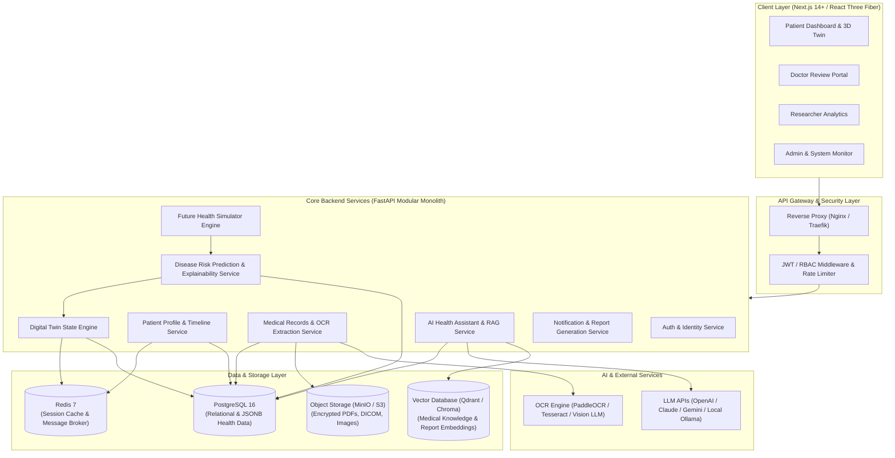

# System Architecture Document

## Project: TwinHealth — AI-Powered Digital Twin for Personalized Healthcare

---

## 1. Architectural Overview

TwinHealth is structured as a modern, modular, cloud-ready healthcare platform that integrates multi-source health data (electronic health records, laboratory reports, wearables, lifestyle metrics, and vitals) into a unified, stateful virtual patient representation (Digital Twin).

The architecture follows a decoupled **Client-Server & Microservices/Modular Monolith** pattern optimized for scalability, privacy, and low-latency interactive 3D rendering.



---

## 2. Core Subsystems & Components

### 2.1 Frontend Presentation Tier (Next.js / React Three Fiber)
* **Framework:** Next.js 14 App Router (React 18/19, TypeScript, Tailwind CSS, Shadcn UI).
* **3D Visualization Engine:** Three.js / React Three Fiber / `@react-three/drei` rendering GLTF/GLB human anatomical body mesh.
* **State Management:** Zustand for client-side global state, TanStack Query (React Query) for server state caching and optimistic updates.
* **Data Visualization:** Recharts / Lucide Icons / Canvas-based timeline widgets.
* **Role-Based Routing:** Route guards enforcing `PATIENT`, `DOCTOR`, `RESEARCHER`, and `ADMIN` dashboards.

### 2.2 API & Backend Application Tier (FastAPI)
* **Framework:** FastAPI (Python 3.11+) with asynchronous request handling (`asyncio`).
* **ORM & Migrations:** SQLAlchemy 2.0 (Async) + Alembic for schema migrations.
* **Validation & Serialization:** Pydantic v2 schemas for strict input/output typing.
* **Task Queues & Background Workers:** Celery / ARQ / FastAPI BackgroundTasks for heavy operations (OCR extraction, batch prediction, embedding generation).

### 2.3 Medical Document Processing & OCR Subsystem
```text
[PDF / Image Upload]
         ↓
[File Type & Anti-Virus / Magic Byte Validation]
         ↓
[Encrypted Storage in MinIO / S3]
         ↓
[Preprocessing (Deskew, Denoise, Binarize)]
         ↓
[OCR Engine: PaddleOCR / Tesseract / Vision LLM]
         ↓
[Medical Entity Extraction & Normalization via Regex + LLM]
         ↓
[Human Verification / Confirmation Stage]
         ↓
[Structured Lab Results Stored in PostgreSQL]
         ↓
[Digital Twin State Recalculation Triggered]
```

### 2.4 Digital Twin State Engine
The Digital Twin is not just a static 3D model; it is a **real-time state machine** representing multi-organ physiological status:
* **Organ System Nodes:**
  * **Brain / Neurological:** Stress, sleep quality, cognitive wellness score, stroke risk.
  * **Cardiovascular / Heart:** Blood pressure, heart rate, cholesterol (LDL/HDL), ECG status, Framingham/AHA risk score.
  * **Respiratory / Lungs:** SpO₂, respiratory rate, smoking history, pulmonary metrics.
  * **Hepatic / Liver:** ALT, AST, Bilirubin, lifestyle alcohol impact score.
  * **Renal / Kidneys:** Creatinine, eGFR, BUN, hydration level.
  * **Metabolic / Endocrine:** Fasting blood glucose, HbA1c, BMI, Diabetes risk index.
* **State Computation:** Whenever a new vital, report, or lifestyle entry is saved, the state engine computes aggregate organ health scores (0–100 scale: *Optimal*, *Normal*, *Monitoring*, *High Risk*).

### 2.5 Machine Learning & Explainable AI (XAI) Pipeline
```text
[Patient Features] → [Scaler / Imputer Pipeline] → [Ensemble / Tree Models] → [Risk Probabilities]
                                                               ↓
                                                [SHAP TreeExplainer / KernelExplainer]
                                                               ↓
                                                [Feature Contribution Weights (Waterfall)]
                                                               ↓
                                                [Natural Language Explanation Engine]
```

### 2.6 RAG (Retrieval-Augmented Generation) AI Assistant
* **Chunking Strategy:** Semantic chunking of verified patient medical documents + curated clinical reference guides (NCBI/WHO guidelines).
* **Embedding Model:** `text-embedding-3-small` / `all-MiniLM-L6-v2` (768-dim / 1536-dim).
* **Vector Store:** Qdrant or Chroma with cosine similarity and patient-isolated namespace filtering (`patient_id = current_user`).
* **Context Assembly:** System prompt enforcing medical disclaimer guardrails + user profile summary + top-$k$ retrieved chunks.

---

## 3. Data Flow Architecture

### 3.1 End-to-End User Ingestion Flow
1. **User Authentication:** User logs in via JWT. Token carries `user_id` and `role`.
2. **Data Ingestion:** User inputs vitals or uploads a blood report.
3. **Async Processing:** Fast acknowledgment returned to client; Celery worker runs OCR/LLM entity extraction.
4. **Validation & Storage:** Structured values (e.g., `Glucose = 142 mg/dL`, status = `HIGH`) persisted to `lab_results`.
5. **Twin State Engine Trigger:** Database event invokes `TwinEngine.recalculate_patient_twin(patient_id)`.
6. **ML Inference:** ML risk models (Heart, Diabetes) evaluate updated vector; SHAP values generated.
7. **Real-time Push / Polling:** Frontend receives updated Twin health score and organ statuses via WebSocket / Server-Sent Events (SSE) or TanStack Query refetch.
8. **3D View Update:** React Three Fiber 3D model colors corresponding organ (e.g., Pancreas / Heart glow changed to Yellow/Monitoring).

---

## 4. Non-Functional Requirements & Quality Attributes

| Attribute | Specification | Implementation Strategy |
| :--- | :--- | :--- |
| **Latency** | < 200ms API response (p95), < 1.5s ML inference, < 3s RAG chat | Redis caching, async DB queries, pre-computed SHAP baselines. |
| **Availability** | 99.9% uptime | Stateless FastAPI backend, containerized horizontal scaling. |
| **Security** | Zero-trust RBAC, AES-256 at rest, TLS 1.3 in transit | Strict CORS, encrypted fields for PII, signed URLs for MinIO files. |
| **Scalability** | Support 10,000+ concurrent active patients | Partitioned PostgreSQL tables, connection pooling with asyncpg. |
| **Maintainability**| Clean Architecture / Modular Monolith | Separation of concerns: Routers → Services → Repositories → Schemas. |
