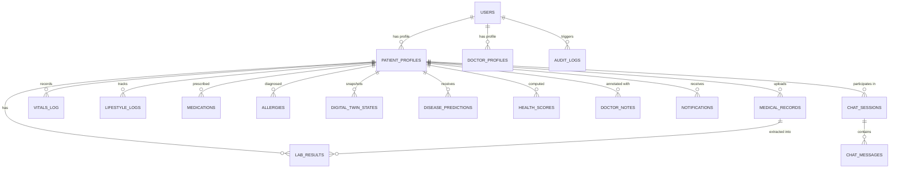

# Database Schema & Data Dictionary

## Project: TwinHealth — AI-Powered Digital Twin for Personalized Healthcare
**Database Engine:** PostgreSQL 16+ with `uuid-ossp` and `pgvector` extensions.

---

## 1. Entity-Relationship Overview



---

## 2. Enumerations (Custom Postgres Types)

```sql
CREATE TYPE user_role AS ENUM ('PATIENT', 'DOCTOR', 'RESEARCHER', 'ADMIN');
CREATE TYPE gender_type AS ENUM ('MALE', 'FEMALE', 'NON_BINARY', 'OTHER', 'PREFER_NOT_TO_SAY');
CREATE TYPE record_type AS ENUM ('BLOOD_REPORT', 'PRESCRIPTION', 'ECG', 'XRAY', 'MRI', 'CT', 'DISCHARGE_SUMMARY', 'OTHER');
CREATE TYPE processing_status AS ENUM ('PENDING', 'PROCESSING', 'EXTRACTED', 'VERIFIED', 'FAILED');
CREATE TYPE organ_system AS ENUM ('BRAIN', 'HEART', 'LUNGS', 'LIVER', 'KIDNEYS', 'STOMACH', 'PANCREAS', 'BONES', 'VASCULAR');
CREATE TYPE organ_status AS ENUM ('OPTIMAL', 'NORMAL', 'MONITORING', 'HIGH_RISK');
CREATE TYPE risk_level AS ENUM ('LOW', 'MODERATE', 'ELEVATED', 'HIGH', 'CRITICAL');
```

---

## 3. Relational Tables Specification

### 3.1 `users` Table
Stores core credentials, authentication provider bindings, and authorization roles.

```sql
CREATE TABLE users (
    id UUID PRIMARY KEY DEFAULT gen_random_uuid(),
    email VARCHAR(255) UNIQUE NOT NULL,
    password_hash VARCHAR(255) NULL, -- NULL if OAuth2
    oauth_provider VARCHAR(50) NULL, -- e.g. 'google'
    oauth_id VARCHAR(255) NULL,
    role user_role NOT NULL DEFAULT 'PATIENT',
    is_active BOOLEAN NOT NULL DEFAULT TRUE,
    is_verified BOOLEAN NOT NULL DEFAULT FALSE,
    created_at TIMESTAMP WITH TIME ZONE DEFAULT CURRENT_TIMESTAMP,
    updated_at TIMESTAMP WITH TIME ZONE DEFAULT CURRENT_TIMESTAMP
);

CREATE INDEX idx_users_email ON users(email);
CREATE INDEX idx_users_role ON users(role);
```

### 3.2 `patient_profiles` Table
Stores patient demographic, biophysical, and onboarding status.

```sql
CREATE TABLE patient_profiles (
    id UUID PRIMARY KEY DEFAULT gen_random_uuid(),
    user_id UUID NOT NULL UNIQUE REFERENCES users(id) ON DELETE CASCADE,
    first_name VARCHAR(100) NOT NULL,
    last_name VARCHAR(100) NOT NULL,
    date_of_birth DATE NOT NULL,
    gender gender_type NOT NULL,
    blood_group VARCHAR(10), -- 'A+', 'B+', 'O+', 'AB-', etc.
    height_cm NUMERIC(5,2), -- e.g., 175.50
    weight_kg NUMERIC(5,2), -- e.g., 72.30
    bmi NUMERIC(4,2) GENERATED ALWAYS AS (weight_kg / ((height_cm/100.0) * (height_cm/100.0))) STORED,
    emergency_contact_phone VARCHAR(50),
    emergency_contact_name VARCHAR(100),
    onboarding_completed BOOLEAN NOT NULL DEFAULT FALSE,
    created_at TIMESTAMP WITH TIME ZONE DEFAULT CURRENT_TIMESTAMP,
    updated_at TIMESTAMP WITH TIME ZONE DEFAULT CURRENT_TIMESTAMP
);

CREATE INDEX idx_patient_user ON patient_profiles(user_id);
```

### 3.3 `doctor_profiles` Table
Stores doctor clinical profile, specialty, license number, and hospital affiliation.

```sql
CREATE TABLE doctor_profiles (
    id UUID PRIMARY KEY DEFAULT gen_random_uuid(),
    user_id UUID NOT NULL UNIQUE REFERENCES users(id) ON DELETE CASCADE,
    full_name VARCHAR(150) NOT NULL,
    specialization VARCHAR(100) NOT NULL, -- e.g. 'Cardiology', 'Endocrinology'
    medical_license_number VARCHAR(100) UNIQUE NOT NULL,
    hospital_affiliation VARCHAR(200),
    phone_number VARCHAR(50),
    verified_by_admin BOOLEAN DEFAULT FALSE,
    created_at TIMESTAMP WITH TIME ZONE DEFAULT CURRENT_TIMESTAMP
);
```

### 3.4 `medical_records` Table
Tracks uploaded documents (PDFs, images, DICOMs) and their OCR extraction lifecycle.

```sql
CREATE TABLE medical_records (
    id UUID PRIMARY KEY DEFAULT gen_random_uuid(),
    patient_id UUID NOT NULL REFERENCES patient_profiles(id) ON DELETE CASCADE,
    title VARCHAR(255) NOT NULL,
    record_type record_type NOT NULL,
    file_path VARCHAR(512) NOT NULL, -- Object storage URI (s3/minio)
    file_size_bytes BIGINT NOT NULL,
    mime_type VARCHAR(100) NOT NULL,
    record_date DATE NOT NULL,
    facility_name VARCHAR(255),
    doctor_name VARCHAR(255),
    ocr_raw_text TEXT,
    ai_summary TEXT,
    status processing_status NOT NULL DEFAULT 'PENDING',
    created_at TIMESTAMP WITH TIME ZONE DEFAULT CURRENT_TIMESTAMP,
    updated_at TIMESTAMP WITH TIME ZONE DEFAULT CURRENT_TIMESTAMP
);

CREATE INDEX idx_med_records_patient ON medical_records(patient_id);
CREATE INDEX idx_med_records_type ON medical_records(record_type);
```

### 3.5 `lab_results` Table
Normalized laboratory parameters extracted from medical documents or manually submitted.

```sql
CREATE TABLE lab_results (
    id UUID PRIMARY KEY DEFAULT gen_random_uuid(),
    patient_id UUID NOT NULL REFERENCES patient_profiles(id) ON DELETE CASCADE,
    record_id UUID REFERENCES medical_records(id) ON DELETE SET NULL,
    test_name VARCHAR(150) NOT NULL, -- e.g. 'Fasting Blood Sugar', 'Total Cholesterol'
    test_category VARCHAR(100) NOT NULL, -- e.g. 'Lipid Panel', 'Complete Blood Count'
    measured_value NUMERIC(10,3) NOT NULL,
    unit VARCHAR(50) NOT NULL, -- e.g. 'mg/dL', 'g/dL', 'mmol/L'
    reference_range_low NUMERIC(10,3),
    reference_range_high NUMERIC(10,3),
    is_abnormal BOOLEAN NOT NULL DEFAULT FALSE,
    is_verified BOOLEAN NOT NULL DEFAULT FALSE, -- Patient/Doctor verified
    test_date TIMESTAMP WITH TIME ZONE NOT NULL,
    created_at TIMESTAMP WITH TIME ZONE DEFAULT CURRENT_TIMESTAMP
);

CREATE INDEX idx_lab_results_patient_test ON lab_results(patient_id, test_name);
CREATE INDEX idx_lab_results_date ON lab_results(test_date DESC);
```

### 3.6 `vitals_log` Table
Time-series vitals logged manually or synced via wearable device connectors.

```sql
CREATE TABLE vitals_log (
    id UUID PRIMARY KEY DEFAULT gen_random_uuid(),
    patient_id UUID NOT NULL REFERENCES patient_profiles(id) ON DELETE CASCADE,
    systolic_bp INT, -- mmHg
    diastolic_bp INT, -- mmHg
    heart_rate INT, -- BPM
    spo2_percent NUMERIC(4,1), -- %
    blood_glucose_mg_dl NUMERIC(6,2), -- mg/dL
    body_temperature_c NUMERIC(4,2), -- °C
    respiratory_rate INT, -- breaths/min
    source VARCHAR(50) DEFAULT 'MANUAL', -- 'MANUAL', 'WEARABLE_SIMULATOR', 'FITBIT_API'
    recorded_at TIMESTAMP WITH TIME ZONE NOT NULL,
    created_at TIMESTAMP WITH TIME ZONE DEFAULT CURRENT_TIMESTAMP
);

CREATE INDEX idx_vitals_patient_time ON vitals_log(patient_id, recorded_at DESC);
```

### 3.7 `lifestyle_logs` Table
Daily or episodic behavioral and wellness trackers.

```sql
CREATE TABLE lifestyle_logs (
    id UUID PRIMARY KEY DEFAULT gen_random_uuid(),
    patient_id UUID NOT NULL REFERENCES patient_profiles(id) ON DELETE CASCADE,
    sleep_duration_hours NUMERIC(4,2),
    sleep_quality_rating INT CHECK (sleep_quality_rating BETWEEN 1 AND 5),
    water_intake_liters NUMERIC(4,2),
    daily_steps INT,
    active_exercise_minutes INT,
    diet_quality_score INT CHECK (diet_quality_score BETWEEN 1 AND 10),
    stress_level INT CHECK (stress_level BETWEEN 1 AND 10),
    alcohol_units NUMERIC(4,1) DEFAULT 0,
    cigarettes_smoked INT DEFAULT 0,
    log_date DATE NOT NULL,
    created_at TIMESTAMP WITH TIME ZONE DEFAULT CURRENT_TIMESTAMP,
    UNIQUE(patient_id, log_date)
);

CREATE INDEX idx_lifestyle_patient_date ON lifestyle_logs(patient_id, log_date DESC);
```

### 3.8 `medications` and `allergies` Tables
Active prescriptions and documented allergic reactions.

```sql
CREATE TABLE medications (
    id UUID PRIMARY KEY DEFAULT gen_random_uuid(),
    patient_id UUID NOT NULL REFERENCES patient_profiles(id) ON DELETE CASCADE,
    medication_name VARCHAR(200) NOT NULL,
    dosage VARCHAR(100) NOT NULL, -- e.g. '500mg'
    frequency VARCHAR(100) NOT NULL, -- e.g. 'Twice daily after meals'
    route VARCHAR(50) DEFAULT 'ORAL',
    start_date DATE NOT NULL,
    end_date DATE,
    is_active BOOLEAN NOT NULL DEFAULT TRUE,
    prescribed_by VARCHAR(200),
    created_at TIMESTAMP WITH TIME ZONE DEFAULT CURRENT_TIMESTAMP
);

CREATE TABLE allergies (
    id UUID PRIMARY KEY DEFAULT gen_random_uuid(),
    patient_id UUID NOT NULL REFERENCES patient_profiles(id) ON DELETE CASCADE,
    allergen VARCHAR(150) NOT NULL, -- e.g. 'Penicillin', 'Peanuts'
    reaction VARCHAR(255), -- e.g. 'Hives, anaphylaxis'
    severity VARCHAR(50) NOT NULL DEFAULT 'MODERATE', -- 'MILD', 'MODERATE', 'SEVERE'
    diagnosed_date DATE,
    created_at TIMESTAMP WITH TIME ZONE DEFAULT CURRENT_TIMESTAMP
);
```

### 3.9 `digital_twin_states` Table
State snapshots of the patient's virtual twin, capturing individual organ statuses and aggregate scores.

```sql
CREATE TABLE digital_twin_states (
    id UUID PRIMARY KEY DEFAULT gen_random_uuid(),
    patient_id UUID NOT NULL REFERENCES patient_profiles(id) ON DELETE CASCADE,
    overall_health_score NUMERIC(5,2) NOT NULL, -- 0.00 to 100.00
    organ_states JSONB NOT NULL,
    /* Example JSONB structure:
    {
      "heart": {"status": "MONITORING", "score": 72, "metrics": {"bp": "135/85", "hr": 82}, "risk": "MODERATE"},
      "brain": {"status": "NORMAL", "score": 90, "metrics": {"sleep_avg": 7.2, "stress": 4}, "risk": "LOW"},
      "lungs": {"status": "NORMAL", "score": 95, "metrics": {"spo2": 99}, "risk": "LOW"},
      "liver": {"status": "NORMAL", "score": 88, "metrics": {"alt": 28, "ast": 24}, "risk": "LOW"},
      "kidneys": {"status": "NORMAL", "score": 92, "metrics": {"creatinine": 0.9}, "risk": "LOW"},
      "pancreas": {"status": "MONITORING", "score": 70, "metrics": {"glucose": 138, "hba1c": 6.1}, "risk": "MODERATE"}
    }
    */
    active_alerts JSONB DEFAULT '[]'::jsonb,
    snapshot_timestamp TIMESTAMP WITH TIME ZONE DEFAULT CURRENT_TIMESTAMP
);

CREATE INDEX idx_twin_patient_time ON digital_twin_states(patient_id, snapshot_timestamp DESC);
```

### 3.10 `disease_predictions` Table
Results of ML models evaluated on patient data, including SHAP explanations.

```sql
CREATE TABLE disease_predictions (
    id UUID PRIMARY KEY DEFAULT gen_random_uuid(),
    patient_id UUID NOT NULL REFERENCES patient_profiles(id) ON DELETE CASCADE,
    disease_type VARCHAR(100) NOT NULL, -- 'CARDIOVASCULAR_DISEASE', 'TYPE_2_DIABETES', 'STROKE'
    model_name VARCHAR(100) NOT NULL, -- 'XGBoost_Heart_v1.2'
    model_version VARCHAR(50) NOT NULL,
    risk_probability NUMERIC(5,4) NOT NULL, -- e.g. 0.3420 (34.20%)
    risk_category risk_level NOT NULL,
    shap_contributions JSONB NOT NULL,
    /* Example JSONB:
    [
      {"feature": "systolic_bp", "value": 142, "shap_value": 0.18, "description": "Elevated systolic BP increases risk"},
      {"feature": "bmi", "value": 29.4, "shap_value": 0.12, "description": "Overweight BMI increases risk"},
      {"feature": "age", "value": 52, "shap_value": 0.09, "description": "Age contributes to baseline risk"}
    ]
    */
    natural_language_explanation TEXT NOT NULL,
    created_at TIMESTAMP WITH TIME ZONE DEFAULT CURRENT_TIMESTAMP
);

CREATE INDEX idx_predictions_patient_disease ON disease_predictions(patient_id, disease_type);
```

### 3.11 `chat_sessions` and `chat_messages` Table
Conversational sessions with RAG AI assistant with source document citations.

```sql
CREATE TABLE chat_sessions (
    id UUID PRIMARY KEY DEFAULT gen_random_uuid(),
    patient_id UUID NOT NULL REFERENCES patient_profiles(id) ON DELETE CASCADE,
    title VARCHAR(255) DEFAULT 'Health Conversation',
    created_at TIMESTAMP WITH TIME ZONE DEFAULT CURRENT_TIMESTAMP,
    updated_at TIMESTAMP WITH TIME ZONE DEFAULT CURRENT_TIMESTAMP
);

CREATE TABLE chat_messages (
    id UUID PRIMARY KEY DEFAULT gen_random_uuid(),
    session_id UUID NOT NULL REFERENCES chat_sessions(id) ON DELETE CASCADE,
    sender VARCHAR(20) NOT NULL, -- 'USER', 'ASSISTANT', 'SYSTEM'
    message_text TEXT NOT NULL,
    cited_records JSONB DEFAULT '[]'::jsonb, -- Array of referenced medical_record IDs
    created_at TIMESTAMP WITH TIME ZONE DEFAULT CURRENT_TIMESTAMP
);

CREATE INDEX idx_chat_messages_session ON chat_messages(session_id, created_at ASC);
```

### 3.12 `audit_logs` Table
Immutable security log tracking all reads/writes to sensitive medical and identity records.

```sql
CREATE TABLE audit_logs (
    id UUID PRIMARY KEY DEFAULT gen_random_uuid(),
    user_id UUID REFERENCES users(id) ON DELETE SET NULL,
    action VARCHAR(100) NOT NULL, -- e.g., 'VIEW_PATIENT_RECORDS', 'EXPORT_REPORT'
    resource_type VARCHAR(100) NOT NULL, -- 'PATIENT', 'MEDICAL_RECORD', 'ML_PREDICTION'
    resource_id VARCHAR(255),
    ip_address VARCHAR(45),
    user_agent VARCHAR(512),
    timestamp TIMESTAMP WITH TIME ZONE DEFAULT CURRENT_TIMESTAMP
);

CREATE INDEX idx_audit_logs_user_time ON audit_logs(user_id, timestamp DESC);
```
