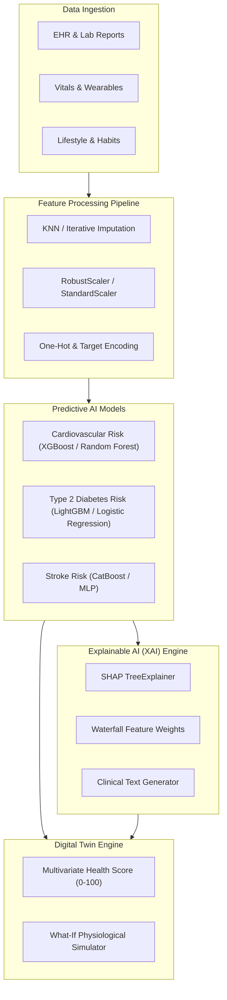

# Machine Learning, AI & Analytical Modeling Specification

## Project: TwinHealth — AI-Powered Digital Twin for Personalized Healthcare

---

## 1. Machine Learning Pipelines Overview

TwinHealth employs a multi-tiered AI architecture combining **Supervised ML for Disease Risk Estimation**, **Explainable AI (SHAP/LIME)** for transparency, **Mathematical Physiological Modeling** for Health Scoring & Simulation, and **RAG (Retrieval-Augmented Generation)** for clinical document interaction.

---

## 2. Predictive Models Specification

### 2.1 Model 1: 10-Year Cardiovascular Disease (CVD) Risk
* **Primary Target:** Binary classification ($y \in \{0, 1\}$) indicating 10-year risk of cardiovascular event.
* **Benchmark Datasets:** Framingham Heart Study Dataset / UCI Heart Disease Repository / Kaggle Cardiovascular Dataset ($N \approx 70,000$).
* **Features ($X$):**
  1. `age` (Years, integer)
  2. `gender` (0: Female, 1: Male)
  3. `systolic_bp` (mmHg, continuous)
  4. `diastolic_bp` (mmHg, continuous)
  5. `cholesterol_total` (mg/dL, continuous)
  6. `cholesterol_hdl` (mg/dL, continuous)
  7. `bmi` ($\text{kg/m}^2$, continuous)
  8. `is_smoker` (0: No, 1: Yes)
  9. `is_diabetic` (0: No, 1: Yes)
  10. `physical_activity_hours_week` (continuous)
* **Algorithms Evaluated:**
  * Baseline: Logistic Regression ($L_2$ regularized)
  * Tree Ensembles: Random Forest, XGBoost, CatBoost
  * Neural: Multi-Layer Perceptron (2 hidden layers: 64, 32 nodes + Dropout)
* **Target Performance Metrics:**
  * ROC-AUC $\ge 0.85$
  * F1-Score $\ge 0.80$
  * Calibration Error (Brier Score) $\le 0.12$

### 2.2 Model 2: Type 2 Diabetes Mellitus (T2D) Risk
* **Primary Target:** Binary probability of pre-diabetes/diabetes onset within 5 years.
* **Benchmark Datasets:** CDC BRFSS (Behavioral Risk Factor Surveillance System) / Pima Indians Diabetes Dataset ($N \approx 253,000$).
* **Features ($X$):**
  1. `age_group` (Ordinal 1–13)
  2. `bmi` (continuous)
  3. `high_bp` (0: Normal, 1: Diagnosed High BP)
  4. `high_cholesterol` (0: Normal, 1: High)
  5. `fasting_glucose` (mg/dL, continuous)
  6. `hba1c` (%, continuous)
  7. `physical_activity_days` (0–7)
  8. `gen_health_rating` (1: Excellent to 5: Poor)
  9. `family_history_diabetes` (0: No, 1: Yes)
* **Target Performance Metrics:**
  * ROC-AUC $\ge 0.84$
  * Precision-Recall AUC $\ge 0.78$

---

## 3. Explainable AI (XAI) Integration

For clinical trust and research validity, predictions MUST provide local attribution for each individual inference:

### 3.1 SHAP (SHapley Additive exPlanations)
For tree-based models (XGBoost / LightGBM), compute exact TreeSHAP values:

$$\phi_i(x) = \sum_{S \subseteq F \setminus \{i\}} \frac{|S|!(|F| - |S| - 1)!}{|F|!} \left[ f_x(S \cup \{i\}) - f_x(S) \right]$$

* **Base Value ($E[f(x)]$):** Baseline population risk.
* **Local Feature Attributions ($\phi_i$):** Positive values indicate factors pushing the patient toward higher risk (e.g. `systolic_bp = 145` $\rightarrow \phi = +0.065$); negative values indicate protective factors (e.g. `is_smoker = 0` $\rightarrow \phi = -0.035$).
* **UI Visualization:** Horizontal waterfall chart showing the top 5 contributing factors with plain-language explanations.

---

## 4. AI Health Score Algorithm

The **TwinHealth Composite Score ($S \in [0, 100]$)** represents a holistic, multi-domain wellness and physiological index calculated from 6 sub-indices:

$$S = \sum_{k=1}^{6} w_k \cdot S_k$$

### 4.1 Weighting & Sub-Score Matrix

| Sub-Index ($k$) | Domain | Weight ($w_k$) | Key Input Metrics | Optimal Reference |
| :--- | :--- | :--- | :--- | :--- |
| $S_1$ | **Cardiovascular & Vitals** | 0.25 | BP, Resting HR, SpO₂ | BP: 110–120/70–80, HR: 60–75 BPM, SpO₂ $\ge 98\%$ |
| $S_2$ | **Metabolic & Blood Profile**| 0.25 | Fasting Glucose, HbA1c, Lipids | Glucose: 70–99 mg/dL, HbA1c $< 5.7\%$, Chol $< 200$ |
| $S_3$ | **Body Composition** | 0.15 | BMI, Height/Weight Ratio | BMI: $18.5 - 24.9\ \text{kg/m}^2$ |
| $S_4$ | **Sleep & Recovery** | 0.15 | Sleep Duration & Quality | 7.0–8.5 hrs, Quality $\ge 4/5$ |
| $S_5$ | **Physical Activity** | 0.10 | Steps, Active Exercise Mins | Steps $\ge 8000$, Active $\ge 30\ \text{min/day}$ |
| $S_6$ | **Lifestyle & Toxic Exposures**| 0.10 | Smoking, Alcohol, Stress | Non-smoker, Alcohol $\le 2\ \text{units/wk}$, Stress $\le 3/10$ |

### 4.2 Score Calculation Rules
* Sub-scores $S_k \in [0, 100]$ are calculated using Gaussian / sigmoid penalty functions around clinical optimal bands.
* **Classification Scale:**
  * **90 – 100:** *Optimal Health* (Green)
  * **75 – 89:** *Good / Stable* (Teal)
  * **60 – 74:** *Monitoring Required* (Amber / Yellow)
  * **< 60:** *Elevated Risk / Action Recommended* (Red)

---

## 5. Future Health Simulation Engine (What-If Dynamics)

The simulation engine allows patients and clinicians to forecast potential changes in risk and health scores under hypothetical lifestyle interventions.

### 5.1 Dynamic Modification Equations
Given baseline state vector $\mathbf{x}_0$ and user adjustment vector $\mathbf{\Delta}$ over a time horizon $t \in [1, 12]$ months:

$$\text{BMI}(t) = \text{BMI}_0 + \left( \Delta_{\text{weight}} \cdot \left(1 - e^{-t / \tau_{\text{met}}}\right) \right) / h^2$$

$$\text{BP}_{\text{systolic}}(t) = \text{BP}_0 - \beta_{\text{ex}} \cdot \ln(1 + \Delta_{\text{exercise}}) - \beta_w \cdot \Delta_{\text{BMI}}(t)$$

$$\text{Risk}_{\text{sim}}(t) = \mathcal{M}\left( \mathbf{x}(t) \right)$$

* $\tau_{\text{met}} \approx 3.0\ \text{months}$ (Metabolic stabilization time constant).
* $\beta_{\text{ex}} \approx 3.5\ \text{mmHg}$ reduction per unit exercise frequency increase.
* $\beta_w \approx 1.0\ \text{mmHg}$ reduction per $1\ \text{kg/m}^2$ BMI reduction.
* $\mathcal{M}$: Trained XGBoost risk model evaluating future feature vector $\mathbf{x}(t)$.

---

## 6. Document Parsing & RAG Specification

### 6.1 OCR & Extraction Pipeline
1. **Engine:** PaddleOCR / Tesseract 5 / Vision LLM with layout analysis.
2. **Entity Recognition:** Extract (Test Name, Numeric Value, Unit, Lower Bound, Upper Bound, Date).
3. **Medical Ontology Mapping:** Map test names to LOINC (Logical Observation Identifiers Names and Codes) where applicable.

### 6.2 Vector Search & Grounding
* **Chunking:** Document sections split by test category (250–500 tokens with 50-token overlap).
* **Embeddings:** 1536-dimensional vectors stored in Qdrant/Chroma with payload metadata `{patient_id, record_id, category, date}`.
* **Retrieval:** $k=4$ chunks using Cosine Distance + MMR (Maximal Marginal Relevance) for diversity.
* **Prompt Safety Guardrail:** Strict system instructions enforcing citation of source documents and non-prescriptive medical disclaimers.
