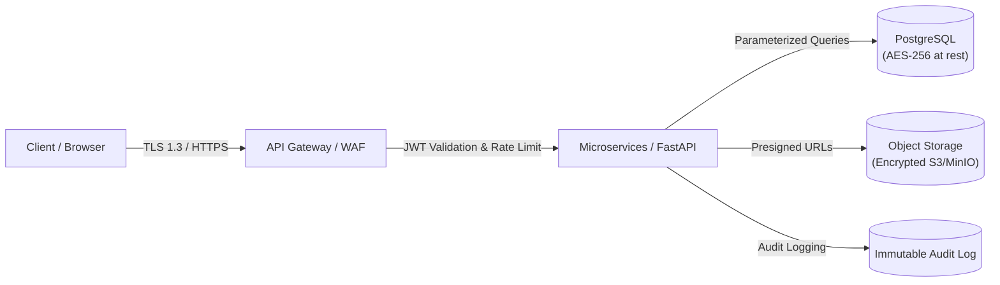

# Security, Privacy & Healthcare Compliance Specification

## Project: TwinHealth — AI-Powered Digital Twin for Personalized Healthcare

---

## 1. Security Architecture & Threat Model

Healthcare applications handle **Protected Health Information (PHI)** and **Personally Identifiable Information (PII)**. TwinHealth adopts a **Zero-Trust Security Architecture** ensuring confidentiality, integrity, availability, and auditability.

---

## 2. Role-Based Access Control (RBAC) Matrix

| Resource / Action | `PATIENT` | `DOCTOR` | `RESEARCHER` | `ADMIN` |
| :--- | :---: | :---: | :---: | :---: |
| **View Own Health Twin & Records** | ✅ Yes | N/A | N/A | N/A |
| **Upload Own Medical Records** | ✅ Yes | N/A | N/A | N/A |
| **View Assigned Patient Twins & Records** | ❌ No | ✅ Yes | ❌ No | ❌ No |
| **Add Doctor Clinical Notes** | ❌ No | ✅ Yes | ❌ No | ❌ No |
| **Access Anonymized Research Datasets** | ❌ No | ❌ No | ✅ Yes | ❌ No |
| **Evaluate / Compare ML Models** | ❌ No | ❌ No | ✅ Yes | ✅ Yes |
| **Manage Users & Role Permissions** | ❌ No | ❌ No | ❌ No | ✅ Yes |
| **View System Audit Logs** | ❌ No | ❌ No | ❌ No | ✅ Yes |

---

## 3. Cryptography & Data Protection

### 3.1 Data in Transit
* Enforce **HTTPS with TLS 1.3** across all public and internal endpoints.
* HTTP Strict Transport Security (HSTS) with `max-age=31536000; includeSubDomains`.
* Restrict CORS to explicitly whitelisted client origins.

### 3.2 Data at Rest
* Database storage encrypted using **AES-256**.
* Passwords hashed using **Argon2id** (or **Bcrypt** with cost factor $\ge 12$).
* Sensitive PII fields (national IDs, exact contact phone numbers) encrypted column-level using AES-GCM-256 before storage.
* Medical documents in Object Storage (MinIO/S3) encrypted with Server-Side Encryption (SSE-S3 / KMS).
* Document access served strictly via short-lived (15-minute) **Presigned URLs**.

---

## 4. Healthcare Privacy Frameworks Alignment

TwinHealth adheres to the fundamental principles of major privacy regulations:

### 4.1 Digital Personal Data Protection (DPDP) Act & GDPR Principles
1. **Consent Management:** Explicit, granular, revocable consent obtained at patient onboarding.
2. **Purpose Limitation:** Patient data processed exclusively for health analytics and twin simulation.
3. **Data Minimization:** Only clinically relevant parameters are extracted and stored.
4. **Right to Erasure & Export:** Users can export all health data in structured JSON or request complete profile and record deletion.

### 4.2 Research Data Anonymization (Safe Harbor Standard)
Before patient data is aggregated for researcher access or ML model retraining:
* Remove direct identifiers (Name, Email, Phone, Address, IP, SSN/Aadhaar).
* Dates shifted by random offset (-365 to +365 days) preserving relative intervals.
* Age values $> 89$ capped at `89+` to prevent re-identification.

---

## 5. AI Safety Guardrails & Medical Ethics

TwinHealth is classified as a **Clinical Decision-Support & Educational Health Prototype**, NOT an autonomous diagnostic device.

### 5.1 System Guardrails & Disclaimers
1. **Non-Prescriptive Rule:** AI Assistant and ML prediction outputs must never prescribe prescription dosages or issue definitive diagnostic assertions.
2. **Clinical Verification Notice:** Every report summary and risk assessment is stamped with:
   > *"TwinHealth is an AI-assisted health monitoring prototype for informational purposes only. Always consult a qualified medical professional for diagnosis and treatment."*
3. **Emergency Redirection:** If user queries or vitals suggest critical emergency conditions (e.g. severe chest pain, stroke symptoms, acute shortness of breath), the system immediately displays emergency hotlines and hospital emergency guidance.
4. **Transparent Explainability:** Predictions cannot be presented as a standalone percentage without clear SHAP feature breakdowns.
